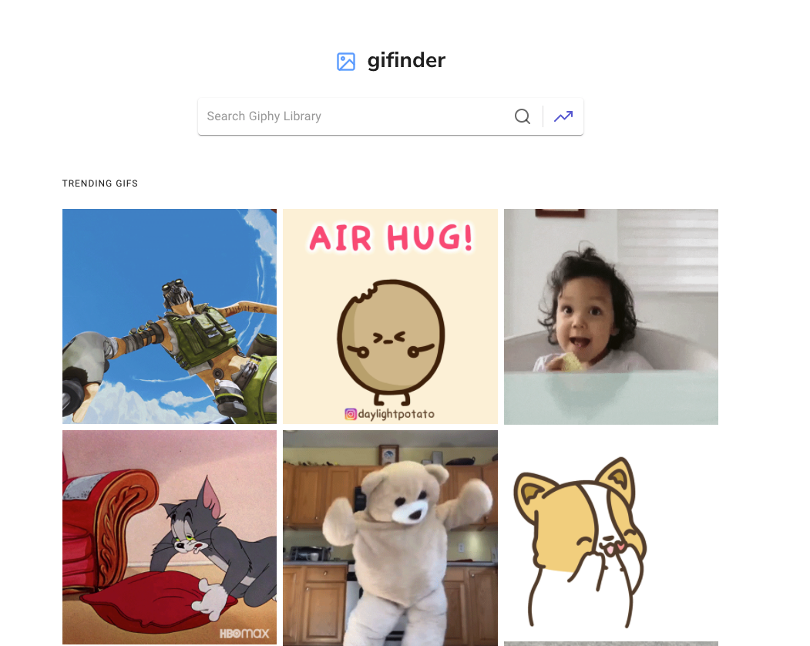

# Gifinder 2.0

Gifinder is a simple react application prototype for finding GIFS. Because this is a prototype, it uses the [GIPHY](https://developers.giphy.com/docs/) public API.

## Getting Started

### Installing

Run the following commands to start the app in development mode. Please check the package.json script for further modes.

Clone this repo:
```sh
$ git clone git@github.com:richardblondet/react-giphy-2022.git react-giphy-2022 && cd react-giphy-2022

```
Install and start:
```sh
npm install && npm start
```


## Built With

* [React](https://reactjs.org/) - The web framework used
* [Material UI 5](https://mui.com/) - The react config framework
* [React Icons by Netlify](https://react-icons.netlify.com/) - [Feather Icons](https://feathericons.com/) 

## Authors

* **Richard Blondet**  - [RichardBlondet](https://github.com/richardblondet)

## License

This project is licensed under the MIT License - see the [LICENSE](LICENSE) file for details.